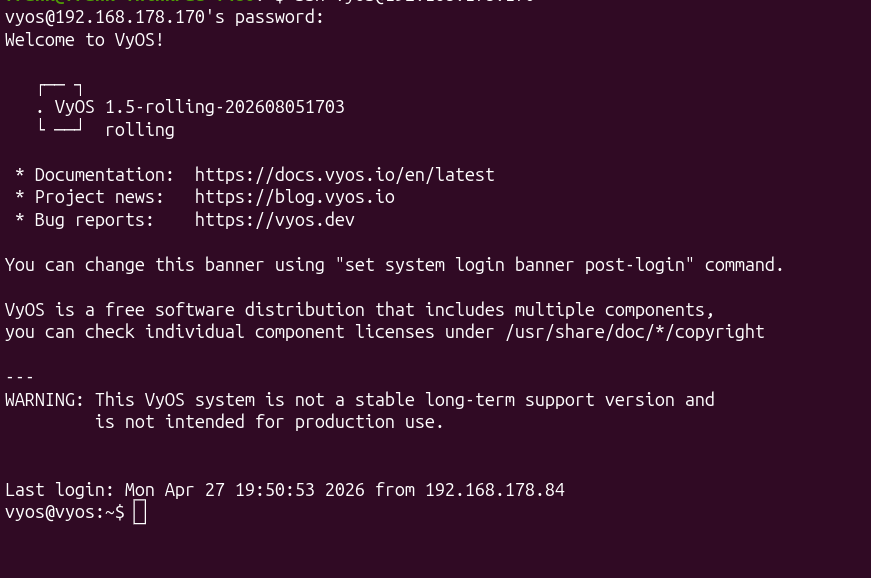

# VyOS for Radxa ROCK 5B

> Unofficial community build of **VyOS Rolling** for the **Radxa ROCK 5B**.

[](https://github.com/frogro/vyos-build/releases)
[](https://github.com/frogro/vyos-build/releases)
[](https://github.com/frogro/vyos-build/actions/workflows/build-vyos-rock5b.yml)
[](https://paypal.me/FGrootens)



## Table of Contents

- [Features](#features)
- [Quick Start](#quick-start)
- [First Boot and Login](#first-boot-and-login)
- [Optional Helper Scripts](#optional-helper-scripts)
- [Supported Hardware](#supported-hardware)
- [Build from Source](#build-from-source)
- [Build Design](#build-design)
- [Releases](#releases)
- [Changelog](CHANGELOG.md)
- [Updating from Upstream](#updating-from-upstream)
- [License and Trademarks](#license-and-trademarks)
- [Support the Project](#️-support-the-project)

This repository provides an unofficial VyOS image for the Radxa ROCK 5B by combining:

- the VyOS ARM64 userspace and configuration system;
- an Armbian ROCK 5B kernel, firmware, modules, and boot chain;
- ROCK 5B-specific first-boot networking helpers.

> [!WARNING]
> This is an unofficial community build. It is not produced, supported, or endorsed by the VyOS project or Radxa. Rolling releases may contain regressions and should be tested before production use.

## Features

- ROCK 5B boot through the Armbian boot chain
- HDMI and serial console
- Realtek RTL8125 Ethernet through the `r8169` driver
- Deterministic Ethernet interface naming as `eth0`
- Automatic wired WAN setup on first boot:
  - dynamic binding to the board's actual Ethernet MAC address
  - DHCP on the detected Ethernet interface
  - default-route distance `1`
  - SSH enabled
- Optional wireless access point, DHCP server, DNS forwarding, and NAT
- Optional LTE/5G modem support
- GitHub Actions workflow for reproducible image builds
- Ready-to-flash compressed image published through GitHub Releases

The first-boot Ethernet setup starts after VyOS has completed its normal boot configuration. It saves Ethernet and SSH settings to `/config/config.boot`, starts the persistent VyOS DHCP client, verifies that SSH is listening, and disables its own first-boot timer after success.

---

## Quick Start

### 1. Download the ready-to-use image

Open the [Releases page](https://github.com/frogro/vyos-build/releases) and download:

```text
vyos-rock5b-fresh.img.xz
SHA256SUMS
```

Verify the download on Linux:

```bash
sha256sum -c SHA256SUMS
```

The uncompressed image is approximately 6 GB. Use a target drive larger than the image. An 8 GB or larger SD card, eMMC module, NVMe SSD, or USB drive is recommended.

### 2. Flash with balenaEtcher

[balenaEtcher](https://etcher.balena.io/) is available for Linux, Windows, and macOS.

1. Start balenaEtcher.
2. Select `vyos-rock5b-fresh.img.xz` directly.
3. Select the SD card, eMMC module, SSD, or USB drive.
4. Click **Flash**.
5. Wait for flashing and verification to finish.

> [!CAUTION]
> Flashing destroys all data on the selected target drive. Verify the destination carefully.

### 3. Flash from Linux with `dd`

Replace `/dev/sdX` with the complete target device, not a partition such as `/dev/sdX1`.

#### Option A: write the compressed image directly

```bash
sudo umount /dev/sdX?* 2>/dev/null || true
xz -dc vyos-rock5b-fresh.img.xz | sudo dd of=/dev/sdX bs=4M status=progress conv=fsync
sync
sudo eject /dev/sdX
```

#### Option B: extract first, then write

This may be faster on slower systems because decompression and writing do not occur simultaneously.

```bash
xz -dk vyos-rock5b-fresh.img.xz
sudo umount /dev/sdX?* 2>/dev/null || true
sudo dd if=vyos-rock5b-fresh.img of=/dev/sdX bs=4M status=progress conv=fsync
sync
sudo eject /dev/sdX
```

---

## First Boot and Login

1. Connect the ROCK 5B Ethernet port to a network that provides DHCP.
2. Insert or attach the flashed boot drive.
3. Power on the ROCK 5B.
4. Allow approximately 60–90 seconds for first-boot configuration.
5. Find the assigned address in your router or DHCP server.
6. Connect over SSH.

Default credentials for this image:

```text
Username: vyos
Password: vyos
```

Example:

```bash
ssh vyos@192.168.1.100
```

Replace the example address with the address assigned to your ROCK 5B.

> [!IMPORTANT]
> Change the default password immediately after the first login. For stronger security, configure SSH key authentication and stop using password-based login.

Change the password:

```text
configure
set system login user vyos authentication plaintext-password 'YOUR_NEW_PASSWORD'
commit
save
exit
```

Check Ethernet locally from the HDMI or serial console:

```bash
ip -4 -br addr show eth0
```

<details>
<summary><strong>First-boot diagnostics</strong></summary>

```bash
cat /config/dhcp-wan-firstboot-wrapper.log
cat /config/dhcp-wan-ssh-setup.log
systemctl status dhclient@eth0.service --no-pager -l
```

The first-boot marker is:

```text
/config/.dhcp-wan-ssh-firstboot-done
```

</details>

---

## Optional Helper Scripts

The image includes helper scripts in `/home/vyos`.

### Configure a wireless access point

```bash
/home/vyos/ap-dhcp-wan-setup.sh
```

This is separate from the automatic wired DHCP and SSH setup. Run it only when an access point, DHCP server, DNS forwarding, and NAT are required.

### Configure a modem

```bash
sudo /home/vyos/modem-connect.sh
```

Modem support depends on the modem, transport, drivers, firmware, carrier, and APN.

---

## Supported Hardware

### Wi-Fi adapters

`ap-dhcp-wan-setup.sh` does not hard-code a specific chipset. It enumerates every `phy` under `/sys/class/ieee80211`, reads supported interface modes from the kernel with `iw phy <phy> info`, and only offers devices that report AP mode support.

#### Known working hardware

- MediaTek MT7921-class M.2/PCIe Wi-Fi 6 adapters
- Realtek RTL8852-class M.2/PCIe Wi-Fi 6 adapters
- MediaTek MT7612U-based USB adapters

#### Expected to work

- Other Linux `mac80211` adapters that advertise AP mode

Adapters whose drivers only support client or station mode cannot be used by the AP helper.

Useful diagnostics:

```bash
ip link show
iw dev
dmesg
```

### Cellular modems

`modem-connect.sh` supports PCIe- and USB-attached modems through ModemManager using QMI or MBIM, as well as a raw AT/RNDIS fallback path.

#### Tested and confirmed working

- Fibocom FM350-GL, including automatic FCC unlock over the AT port

#### Expected to work with compatible drivers and firmware

- Quectel RM505Q
- Intel XMM7560-based modems
- Other QMI- or MBIM-capable modems supported by ModemManager

Actual connectivity also depends on the SIM carrier, APN, regional firmware, and supported bands.

---

## Build from Source

### Build with GitHub Actions

The repository includes:

```text
.github/workflows/build-vyos-rock5b.yml
```

No local ARM64 build environment is required when using the GitHub Actions workflow.

From the GitHub website:

1. Fork or clone this repository.
2. Open **Actions**.
3. Select **Build VyOS Rock5B Image (Rolling + Armbian)**.
4. Click **Run workflow**.
5. Select the `rolling` branch.
6. Wait for the workflow to finish.
7. Download the `vyos-rock5b-image` artifact.

### Build with GitHub CLI

Authenticate and start the workflow:

```bash
gh auth login
gh workflow run build-vyos-rock5b.yml --repo OWNER/vyos-build --ref rolling
sleep 5
gh run list --repo OWNER/vyos-build --workflow=build-vyos-rock5b.yml --limit 1
```

Watch the run:

```bash
gh run watch RUN_ID --repo OWNER/vyos-build --exit-status
```

Download the completed artifact:

```bash
mkdir -p ~/Downloads/vyos-rock5b-RUN_ID
gh run download RUN_ID --repo OWNER/vyos-build --dir ~/Downloads/vyos-rock5b-RUN_ID
```

The compressed image is normally located at:

```text
~/Downloads/vyos-rock5b-RUN_ID/vyos-rock5b-image/vyos-rock5b-fresh.img.xz
```

Replace `OWNER` with your GitHub username and `RUN_ID` with the workflow run ID.

---

## Build Design

The image is assembled from two main components:

1. **Armbian ROCK 5B base** — bootloader, TF-A/U-Boot chain, device tree, Linux kernel, modules, and firmware.
2. **VyOS ARM64 root filesystem** — VyOS userspace, configuration system, services, and CLI.

The build process keeps the Armbian-compatible physical image and boot chain, merges the VyOS root filesystem with the ROCK 5B kernel components, injects the default configuration and helper scripts, and creates a flashable disk image.

---

## Releases

Prebuilt images are published on the [GitHub Releases page](https://github.com/frogro/vyos-build/releases).

Each release should normally contain:

```text
vyos-rock5b-fresh.img.xz
SHA256SUMS
```

The raw `.img` file is approximately 6 GB and is therefore not suitable as a normal GitHub Release asset. Publish the compressed `.img.xz` file instead.

See [CHANGELOG.md](CHANGELOG.md) for the changes in each release.

---

## Updating from Upstream

This repository contains ROCK 5B-specific changes on top of VyOS build sources. Review upstream changes before syncing or rebasing, especially changes involving:

- ARM64 image generation
- boot and root filesystem assembly
- systemd and first-boot services
- interface naming
- VyOS configuration migration

Always keep a backup branch or tag before a major upstream synchronization.

---

## License and Trademarks

The repository contains or builds software from multiple upstream projects. Their respective licenses remain in effect. Review the license and copyright files included in the repository and generated image.

VyOS is a trademark of Sentrium S.L. Radxa and ROCK 5B are associated with Radxa Computer Co., Ltd. This project is an independent community effort.

---

## ❤️ Support the Project

If this project saved you time or made it easier to run VyOS on the Radxa ROCK 5B, please consider supporting its development.

Contributions help cover hardware, testing, maintenance, and development time.

[](https://paypal.me/FGrootens)

Thank you for your support. ☕
